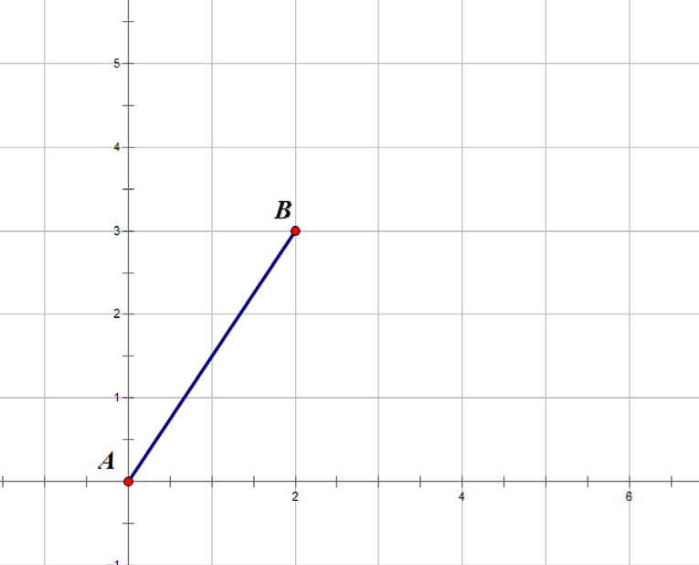
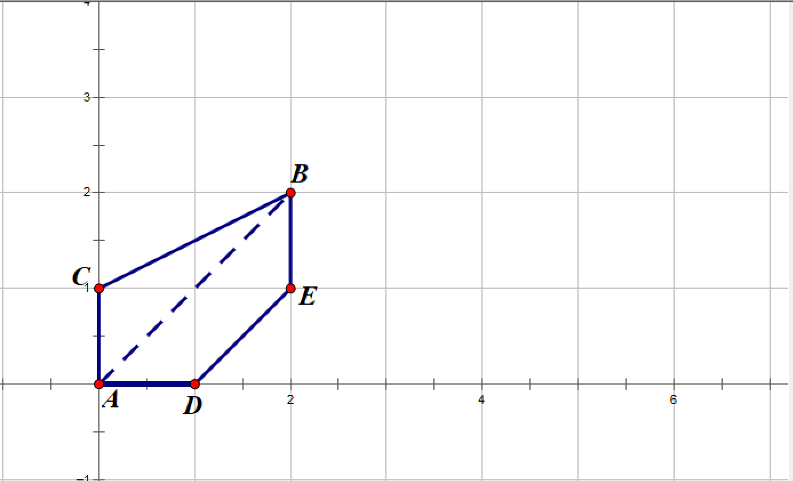

# 2023 Mid - 最速通讯

时间限制：1000 ms / 空间限制：65536 KB

## 题目描述

在平面直角坐标系中，一束信号从原点 $(0,0)$ 出发，需要使其到达 $(n,m)$。

已知这束信号始终沿着直线传播，而且每当经过一个整点 $(x,y)(x,y∈Z)$ 时就必须改变它的传播方向。

你可以**任意**指定每一次信号传递的方向，并且信号传递的方向可以改变**任意**多次，问这束信号最短需要走过的路程是多少？

## 输入

第一行一个正整数 $T$，表示数据的组数。 接下来 $T$ 行，每行两个正整数 $n,m$，保证 $∑max(n,m)<5×10^6$。

## 输出

输出 $T$ 行，每行一个正实数表示最短的路程，你的答案将被视作正确只要其绝对误差或者相对误差小于 $10^{−8}$。

## 输入样例

    2
    2 3
    2 2

## 输出样例

    3.605551275463989
    3.236067977499790

## 样例解释

对于第一组样例，可以从原点 $A$ 直接到达终点 $B$，最短路程显然为 $\sqrt{13}$。

对于第二组样例，由于直接沿直线从 $A$ 到 $B$ 会经过点 $(1,1)$，因此不是一条合法的路径。

可以先到达 $C(0,1)$ 再沿直线到达 $B(2,2)$，路程为 $\sqrt{5}+1$。而从 $A$ 到达 $D(1,0)$，再到达 $E(2,1)$，最后到达 $B$ 也是一条合法的路径，路程为 $\sqrt{2}+2$。

可以证明由 $A$ 只经过 $C$ 到达 $B$ 的这条路径是路程最短的合法路径，最短路程是 $\sqrt{5}+1$。

